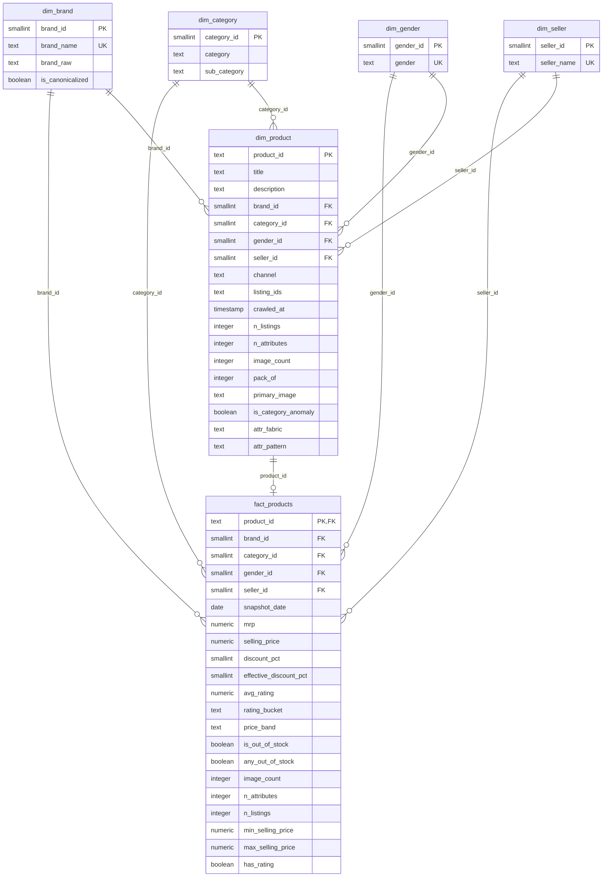

# Phase 4 — Relational Data Model (Star Schema)

**Scope:** analytics-optimized model built from the Phase 3 processed layer.
**Ground truth constraints from data:** 28,080 products (grain), 319 canonical
brands, 4 categories / 15 sub-categories, 4 gender segments (+ Unknown), 499
sellers, one snapshot window (crawl dates 2021-10-02 and 2021-11-02, **0 products
captured on both days**).

---

## 1. Modeling Decisions

### Adopted dimensions
| Dimension | Grain | Justification from data |
|---|---|---|
| `dim_brand` | brand | 319 canonical brands; repeated across products; brand is a core business entity |
| `dim_category` | sub-category (with parent category) | 4 categories / 15 sub-categories form a clean hierarchy after Phase 3 normalization |
| `dim_gender` | gender segment | Gender is a derived categorical (Men/Women/Kids/Mixed/Unknown); a conformed 5-row lookup gives BI filters a stable key |
| `dim_seller` | seller | 499 sellers; many products per seller; supply-concentration questions (Phase 2 §7) need a conformed seller key |
| `dim_product` | product (`product_id`) | 28,080 unique products; the carrier of descriptive + attribute data |

### Fact table
| Fact | Grain | Rows |
|---|---|---|
| `fact_products` | **product × snapshot** | 28,080 (one snapshot in this dataset) |

### Dimensions considered but NOT built (honest, data-driven)
| Candidate | Rejected because |
|---|---|
| `dim_rating` | Only `avg_rating` (a measure) exists — no rating count, review text, or distribution. A rating dimension would have no independent attributes. Rating buckets are kept as a **degenerate dimension** (`rating_bucket`) directly on the fact. |
| `dim_date` | The data is a single snapshot captured on exactly 2 dates; **no product spans both days**. There is no time series to analyze, so a date dimension adds zero value. `snapshot_date` stays on the fact so the fact can absorb future snapshots. |
| `dim_price` / `dim_discount` | Prices/discounts are measures, not independent entities. `price_band` is a degenerate dimension on the fact. |

---

## 2. Tables, Keys & Relationships

```
fact_products  (fact)
  product_id          TEXT  PK/FK → dim_product.product_id
  brand_id            SMALLINT  FK → dim_brand.brand_id
  category_id         SMALLINT  FK → dim_category.category_id
  gender_id           SMALLINT  FK → dim_gender.gender_id
  seller_id           SMALLINT  FK → dim_seller.seller_id
  snapshot_date       DATE
  mrp / selling_price NUMERIC(10,2)
  discount_pct / effective_discount_pct  SMALLINT
  avg_rating          NUMERIC(3,2)
  rating_bucket       TEXT   (degenerate: low/mid/high)
  price_band          TEXT   (degenerate: budget/mid/premium/luxury)
  is_out_of_stock / any_out_of_stock  BOOLEAN
  image_count, n_attributes, n_listings  INT
  min_selling_price, max_selling_price  NUMERIC(10,2)
  has_rating          BOOLEAN

dim_product    (product dimension — 1:1 with fact at product grain)
  product_id          TEXT  PK
  title, description  TEXT
  brand_id            FK → dim_brand          (conformed)
  category_id         FK → dim_category       (conformed)
  gender_id           FK → dim_gender         (conformed)
  seller_id           FK → dim_seller         (conformed)
  channel             TEXT   (salvaged seller-channel from Phase 3)
  listing_ids         TEXT[] (audit ids of the re-crawled listings)
  crawled_at          TIMESTAMP
  n_listings, image_count, n_attributes  INT
  pack_of             INT
  primary_image       TEXT
  is_category_anomaly BOOLEAN
  attr_fabric … attr_character              (40 pivoted product attributes)

dim_brand      brand_id PK, brand_name UNIQUE, brand_raw, is_canonicalized
dim_category   category_id PK, category, sub_category, UNIQUE(category, sub_category)
dim_gender     gender_id PK, gender UNIQUE
dim_seller     seller_id PK, seller_name UNIQUE
```

### Key summary
- **Primary keys:** `product_id` (natural key `pid`, deduped) on `dim_product` and
  `fact_products`; serial surrogates on the four lookup dims.
- **Foreign keys:** `fact_products → dim_product` (1:1 via PK), and
  `fact_products → dim_{brand,category,gender,seller}` (N:1). `dim_product` also
  references the same four conformed dims.
- **Why `product_id` is the natural PK:** `pid` is the Flipkart product identifier,
  unique after Phase 3 dedup (28,080 distinct). `_id` is the listing/crawl id and
  remains as `listing_ids` for lineage.
- **Null handling:** referential integrity is preserved by an explicit `Unknown`
  row (id `0`) in each lookup dim; products with no brand/seller/gender link to it
  instead of dangling NULL FKs. Unknown gender is a real segment (`gender='Unknown'`).

---

## 3. Why This Schema Is Appropriate

1. **Grain is clean and defensible.** `product × snapshot` is the natural
   analytical unit; the fact is 1:1 with `dim_product` today because there is a
   single snapshot, and `snapshot_date` makes the fact ready to absorb future
   crawls (grain would become `product × snapshot`).
2. **Star-shaped joins.** `fact_products` carries all five dimension keys, so
   Phase 2 business questions resolve in a single join hop
   (`fact → dim_brand`, `fact → dim_category`, …).
3. **Conformed dimensions** keep brand/category/gender/seller spellings
   consistent across products and future facts.
4. **Sparse product attributes stay out of the fact.** 40 attributes live on
   `dim_product`; the long-form source data remains in
   `product_attributes` (processed layer) for attribute-level questions.
5. **Degenerate dimensions (rating_bucket, price_band) are query-friendly**
   filters without forcing thin dimension tables.
6. **No fabricated entities.** Rating and date dimensions were explicitly
   rejected because the dataset cannot support them (see table above).

---

## 4. ERD



---

## 5. SQL Implementation Map

- `sql/00_schema.sql` — schema, tables, PKs, FKs, CHECK constraints, `Unknown`
  seed rows (idempotent: `DROP … CASCADE` + `CREATE`).
- `sql/01_indexes.sql` — FK + query-pattern indexes.
- `sql/02_analytics_queries.sql` — the Phase 2 business questions as SQL.
- `scripts/load_to_postgres.py` — deterministic loader (surrogate ids computed in
  Python, bulk `COPY` into PostgreSQL).
- `scripts/db_init.sh` — reproducible database bootstrap (Docker container, schema,
  indexes).
